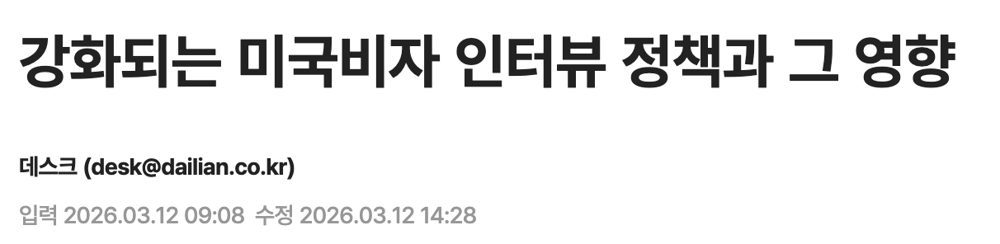
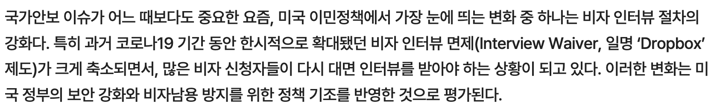
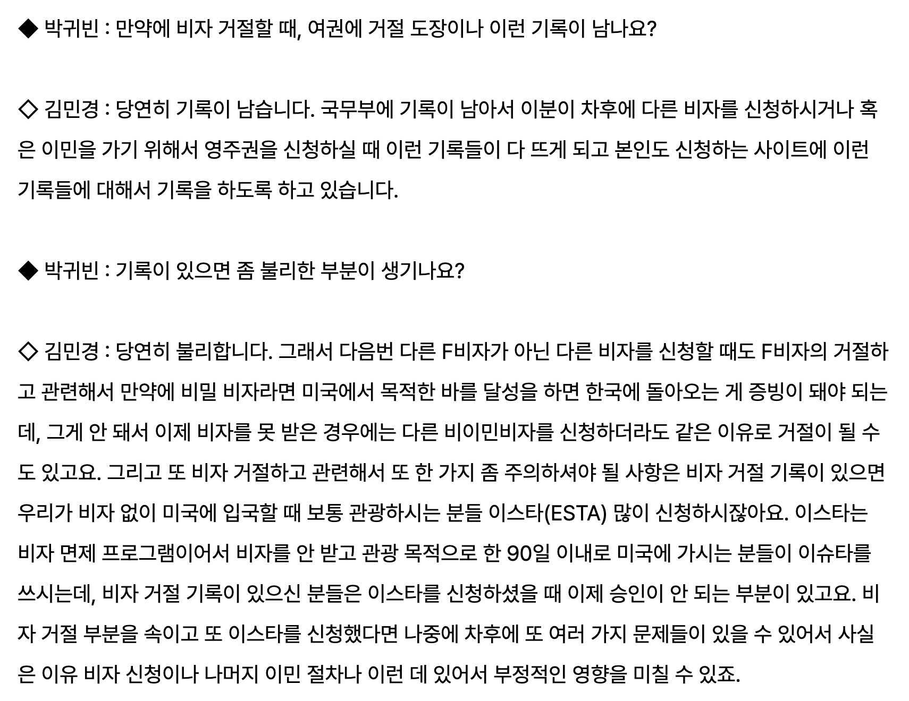

# SKN24-3rd-3Team

### 3RD_PROJECT_3TEAM

---

# 📚 Contents

 

1. [팀 소개](#1--팀-소개)
2. [프로젝트 개요](#2-️-프로젝트-개요)
3. [기술 스택](#3-️-기술-스택)
4. [사용 모델](#4-사용-모델)
5. [시스템 아키텍처](#5-시스템-아키텍처)
6. [WBS](#6-️-wbs)
7. [요구사항 명세서](#7-요구사항-명세서)
8. [수집 데이터 및 전처리 요약](#8-수집-데이터-및-전처리-요약)
9. [DB 연동 구현 코드](#9--db-연동-구현-코드)
10. [테스트 계획&결과 보고서](#10--테스트-계획-및-결과-보고서)
11. [진행과정 중 프로그램 개선 노력](#11-진행과정-중-프로그램-개선-노력)
12. [수행결과](#12--수행결과)
13. [한계](#13-한계)
14. [한 줄 회고](#14--한-줄-회고)

     

 

## 1. 👨‍👩‍👧‍👦 팀 소개

 

### 팀명 : **Waypoint**

_저희는 사용자의 유학 여정에서의 중요한 지점을 함께 만들어드립니다._

 

---

### 🌸 팀원 소개

 

|                                                                             권민세                                                                              |                                                                       박정은                                                                        |                                                                         정재훈                                                                         |                                                                       조아름                                                                        |
| :-------------------------------------------------------------------------------------------------------------------------------------------------------------: | :-------------------------------------------------------------------------------------------------------------------------------------------------: | :----------------------------------------------------------------------------------------------------------------------------------------------------: | :-------------------------------------------------------------------------------------------------------------------------------------------------: |
|  |  |  |  |

 

---

## 2. 📽️ 프로젝트 개요

## 프로젝트 명 : `Viva la Visa`

> “Viva la vida” : 스페인어로 '인생이여 만세!'라는 뜻

`비자 성공을 아자아자!! ୧(⑅˃ᗜ˂⑅)୨ 응원합니다!`

### 2.1 프로젝트 소개

 

**미국 유학에 필요한 입시정보를 알려주고 F-1 비자 인터뷰를 연습할 수 있는 챗봇 개발**
 

본 프로젝트는 미국 유학 준비생들이 겪는 정보의 불균형과 비자 인터뷰에 대한 불안감을 해소하기 위해, RAG(검색 증강 생성) 기술과 멀티 에이전트 워크플로우를 결합한 지능형 챗봇 시스템입니다.

---

### 2.2 프로젝트 배경 및 필요성

|                  연세대학교                   |                일리노이 대학                |
| :-------------------------------------------: | :-----------------------------------------: |
|  |  |

 

#### <h3>분산된 입시 정보로 인한 탐색의 어려움</h3>

연세대학교는 '통합자료실'을 통해 모집요강, 전형 방식, 필요 서류 등 입시 정보를 하나의 PDF 문서로 쉽게 확인할 수 있는 반면, 일리노이 (UIUC, University of Illinois Urbana-Champaign)은 입학 정보가 여러 페이지에 분산되어 있어 한 번에 확인하기 어렵습니다.이로 인해 유학을 준비하는 학생들은 필요한 정보를 각각 찾아봐야 하는 불편함이 있고, 시간 소모와 정보 누락의 문제가 발생할 수 있습니다.

[출처: 데일리안](https://www.dailian.co.kr/news/view/1619827/%EC%B5%9C%EA%B7%BC-%EA%B0%95%ED%99%94%EB%90%98%EB%8A%94-%EB%AF%B8%EA%B5%AD%EB%B9%84%EC%9E%90-%EC%9D%B8%ED%84%B0%EB%B7%B0-%EC%A0%95%EC%B1%85%EA%B3%BC-2026)

#### <h3>비자 거절 사례 증가로 인한 준비 필요성 확대</h3>

최근 미국 비자 심사가 강화되면서 인터뷰 절차가 까다로워지고, 유학생 비자 거절 사례가 증가하고 있는 것으로 나타나고 있습니다. 특히 심사 기준이 세분화되면서 지원자의 학업 목적, 재정 능력, 귀국 의지 등에 대한 평가가 더욱 엄격해지고 있어 비자 인터뷰에 대한 철저한 준비가 필수적인 요소로 자리잡고 있습니다.

 

[출처: YTN](https://www.ytn.co.kr/_ln/0103_202505290847413221)

#### <h3>비자 거절 시 향후 불이익 발생 가능성</h3>

비자 인터뷰에서 거절될 경우 해당 기록이 남게 되며, 이후 비자 재신청이나 입국 심사 과정에서 불리하게 작용할 수 있습니다. 또한 동일한 사유로 반복 거절될 가능성이 높아지기 때문에, 초기 인터뷰에서의 준비 부족은 장기적인 불이익으로 이어질 수 있습니다.

 

### 2.3 프로젝트 목표

 

본 프로젝트는 분산된 미국 대학 입시 정보를 통합 제공하고,
사용자 맞춤형 비자 인터뷰 연습 환경을 제공하여
유학 준비 과정의 비효율을 줄이고 성공적인 합격과 비자 취득을 지원하는 것을 목표로 합니다.

## 3. 🛠️ 기술 스택

|        분류         | 기술/도구                                                                                                                                                                                                                                                                                                 |
| :-----------------: | :-------------------------------------------------------------------------------------------------------------------------------------------------------------------------------------------------------------------------------------------------------------------------------------------------------- |
|    **Language**     |                                                                                                                 |
|   **Development**   |         |
|    **LLM & AI**     |    |
|    **Framework**    |                                                                                                                               |
|    **Vector DB**    |                                                                                                                                                                                                                      |
|    **Database**     |                                                                                                                                                                                                              |
| **Data Processing** |                                                                                                                                                                                                            |
|    **Frontend**     |                                                                                                                                                                                                      |
|  **Collaboration**  |                                                                                                                   |

 

## 4. 사용 모델

| **분류**        | **사용 모델**            |
| --------------- | ------------------------ |
| **임베딩 모델** | BAAI/bge-m3              |
| **LLM 모델**    | ebdm/gemma3-enhanced:12b |

 

**선정 이유**

#### 1. 임베딩 모델 선정 이유

`BAAI/bge-m3`모델은 의미 기반 검색(Dense)과 키워드 기반 검색(Sparse)을 동시에 지원하여,  인터뷰 질문과 같이 특정 키워드(예: visa, study, finance 등)와 문맥 의미를 함께 고려한 정확한 검색이 가능합니다. 또한, 한국와 영어을 기반으로 진행되기 때문에 다국어 임베딩이 뛰어나서 Q&A 기반 인터뷰 데이터 검색에 적합하다고 판단하여 해당 모델을 선정하였습니다.

#### 2. LLM 모델 선정 이유

OpenAI와 같은 외부 API 기반 모델을 사용하지 않고 SLM, 로컬에서 동작하는 모델 선택한 가장 큰 이유는 **개인정보 보호 및 데이터 보안**입니다.  
LLM이 사용하는 데이터에 사용자의 이름, 학교, 전공, 재정 정보 등 인적사항이 포함되어 있기 때문에, 외부 서버로 데이터를 전송하는 방식은 보안 측면에서 적절하지 않다고 판단했습니다.  
따라서 모든 처리를 로컬 환경에서 수행할 수 있는 Ollama 기반 모델을 사용함으로써, 데이터가 외부로 유출되지 않도록 설계하였습니다.  

또한 로컬LLM의 여러 모델들을 사용해본 결과 다음과 같이 gemma3 모델이 결과가 가장 좋았고, agent tool 사용을 위해 지원되는 모델인 `ebdm/gemma3-enhanced:12b`을 선정하였습니다.

## 5. 🧩시스템 아키텍처

## 6. 🖼️ WBS

## 7. 📝요구사항 명세서

## 8. 📁수집 데이터 및 전처리 요약

### 8.1 RDB용 텍스트 데이터

#### 출처:

자세히 보기

1. 뉴욕 대학교 (New York University, NYU)  
    1-1. https://www.nyu.edu/admissions.html  
2. 서던 캘리포니아 대학교 (University of Southern California, USC)  
    2-1. https://admission.usc.edu/  
3. 일리노이 대학교 어바나-샴페인 (University of Illinois Urbana-Champaign, UIUC)  
    3-1. https://illinois.edu/admissions/  
4. 컬럼비아 대학교 (Columbia University)  
    4-1. https://www.columbia.edu/content/columbia-university-admissions  
5. 캘리포니아 대학교, LA (University of California-Los Angeles, UCLA)  
    5-1. https://admission.ucla.edu/  
6. 보스턴 대학교 (Boston University, BU)  
    6-1. https://www.bu.edu/admissions-overview/  
7. 캘리포니아 대학교, 버클리 (UC Berkeley)  
    7-1. https://admissions.berkeley.edu/  
8. 캘리포니아 대학교, 샌디에이고 (University of California-San Diego, UCSD)  
    8-1. https://ucsd.edu/admissions-aid/  
9. 퍼듀 대학교 (Purdue University)  
    9-1. https://admissions.purdue.edu/  
10. 펜실베니아 주립대학교 (Pennsylvania State University-Main Campus’)  
    10-1. https://www.psu.edu/admission  

#### 목적 : 미국 주요 대학들의 입학 정보 및 비자 인터뷰 관련 배경 지식을 체계적으로 저장하기 위하여 RDB를 구축하였습니다.

#### 데이터 전처리 요약

수집한 웹 데이터는 HTML 기반의 비정형 텍스트로 구성되어 있어, RDB에 적합하도록 다음과 같은 전처리 과정을 수행하였습니다.

##### 1. 텍스트 추출 및 정제

Playwright를 활용하여 웹 페이지의 모든 텍스트를 추출한 후,  
script, style, navigation 등 불필요한 HTML 요소를 제거하였습니다.

##### 2. LLM 기반 데이터 구조화

수집된 텍스트를 gpt-4o-mini 모델을 활용하여 JSON 형태로 구조화하고,  
입학 요건, 학비, 일정, FAQ 등 필요한 정보만 추출하였습니다.

##### 3. 데이터 정합성 검증

Pydantic 모델을 사용하여 각 필드의 형식과 구조를 검증하고,  
누락되거나 잘못된 데이터를 제거하여 데이터 품질을 확보하였습니다.

##### 4. 테이블 구조 분리 및 식별자 생성

데이터를 school_info, admission_info, requirement_info, faq_info 테이블로 분리하고,  
각 데이터에 대해 고유 식별자(school_id 등)를 생성하였습니다.

##### 5. RDB 저장을 위한 변환

전처리된 데이터를 JSON 형태로 저장한 후,  
MySQL 데이터베이스에 적재하여 SQL 기반 조회가 가능하도록 구성하였습니다.

#### 최종 전처리 결과

| 전처리 전                                                                                                                           | 전처리 후                                                                                                                           |
| ----------------------------------------------------------------------------------------------------------------------------------- | ----------------------------------------------------------------------------------------------------------------------------------- |
|  |  |

#### ERD

### 8.2 RAG용 데이터

#### 출처: 허깅페이스 데이터셋 활용 (https://huggingface.co/datasets/Blessing988/f1_visa_transcripts)

#### 목적: F1 비자 인터뷰 상황을 반영한 질문-답변(Q&A) 데이터를 Hugging Face에서 로드하여 RAG 시스템을 구축하였습니다.

#### 데이터 전처리 요약

수집한 F1 비자 인터뷰 데이터셋은 대화형 텍스트 구조로 구성되어 있어, RAG 시스템에 적합하도록 다음과 같은 전처리 과정을 수행하였습니다.

##### 1. Q&A 구조 재구성

원본 데이터에서 사용할 Input, Output 컬럼들만 추출했습니다.  
각 데이터를 독립적인 Document 형태로 변환하였습니다.

##### 2. 고유명사 일반화 (Entity Normalization)

데이터셋에는 특정 대학, 국가, 지역, 기관, 전공 등의 고유명사가 다수 포함되어 있어 모델이 특정 사례에 과적합되는 문제를 방지하기 위해 토큰 기반 치환을 수행하였습니다.

##### 3. 금액 및 수치 정보 정규화

인터뷰 데이터에 포함된 다양한 금액 표현을 통일하기 위해 정규표현식을 활용하여 [AMOUNT] 토큰으로 치환화였습니다.

##### 4. 텍스트 정제 및 일관성 유지

문자열이 아닌 값 제거 (NaN 등 예외 처리) 불필요한 특수문자 및 표현을 최소화하였습니다.  
전체 데이터 형식을 일관된 자연어 문장 구조로 유지하였습니다.

##### 5. RAG 최적화를 위한 Document 구조화

전처리된 데이터는 LangChain의 Document 형태로 변환하여 저장하였습니다.

#### 최종 전처리 결과

| 전처리 전                                                                                                                           | 전처리 후                                                                                                                          |
| ----------------------------------------------------------------------------------------------------------------------------------- | ---------------------------------------------------------------------------------------------------------------------------------- |
|  |  |

## 9. 🔗 DB 연동 구현 코드

https://github.com/SKNETWORKS-FAMILY-AICAMP/SKN24-3rd-5Team/tree/dev/project/uinv_sql

## 10. 📻 테스트 계획 및 결과 보고서

테스트 대상: LLM 엔진 (Ollama ebdm/gemma3-enhanced:12b), RAG, 프롬프트 템플릿, 멀티 에이전트

**테스트 지표**
**시스템 평가 기준 지표**
 
| 지표 (Metric) | 설명 | 목표치 /5 |
|--------------|-----|---------|
| 응답 정확성 | 생성된 답변이 참조 (Retrieved Docs, RDB) 답변과 비교해서 정확한 정보 추출하는지 평가에 기반했는가? | 5 |
| 관련성 | 질문의 의도에 맞는 답변을 생성했는가? | 4 |
| UX 흐름 | UX 흐름이 원활한지 평가 | 4 |

**테스트 시나리오 및 결과**

**입시지원 챗봇**

| 서비스        | 질문 (Input Query)                          | 기대 답변 예시                                                              | 실제 모델 답변 (Actual Output)                                                                                                                                                                                                                                                                                                                                                                                                                                                                                                                                                                                          | 판정 |
| ------------- | ------------------------------------------- | --------------------------------------------------------------------------- | ----------------------------------------------------------------------------------------------------------------------------------------------------------------------------------------------------------------------------------------------------------------------------------------------------------------------------------------------------------------------------------------------------------------------------------------------------------------------------------------------------------------------------------------------------------------------------------------------------------------------- | ---- |
| 입시지원 챗봇 | "펜실베니아 대학교 학비 알려줘."            | "펜실베니아 대학교 학비는 8만 1,990달러입니다."                             | "펜실베니아 대학교 학비는 연간 8만 1,990달러입니다. 이 금액은 수업료, 수수료, 그리고 필수 부교재비를 포함하고 있어요. 기숙사비와 식비 등 생활비는 별도로 고려해야 합니다. 더 자세한 내용은 펜실베니아 대학교 재정 지원 홈페이지에서 확인하실 수 있습니다."                                                                                                                                                                                                                                                                                                                                                              | Pass |
| 입시지원 챗봇 | "UCLA대학교에 입학에 필요한 서류를 알려줘." | "UCLA대학교에서 필요한 서류는 성적표, 테스트 걸과 서류, 등등이 필요합니다." | "UCLA 대학교 입학에 필요한 서류는 다음과 같습니다._ 지원서: Common Application 또는 Coalition Application을 통해 제출합니다_ 고등학교 성적 증명서: 정식 증명서 원본을 제출해야 합니다._ SAT/ACT 점수: UCLA는 Test-Free 정책을 시행하고 있지만, 점수를 제출하는 것은 선택 사항입니다._ 영어 능력 시험 점수: TOEFL, IELTS 등 공인 영어 시험 점수가 필요합니다._ 추천서: 고등학교 교사 2명으로부터 추천서를 받아야 합니다._ 에세이: UCLA에서 요구하는 에세이를 작성해야 합니다.\* 경력 및 활동 내용: 지원자의 경험과 활동을 보여주는 자료를 제출해야 합니다. 자세한 내용은 UCLA 입학처 홈페이지에서 확인하실 수 있습니다." | Pass |

**비자 모의면접 개별 질문**
| 서비스 | 질문 (Input Query) | 기대 질문 예시 | 실제 모델 질문 (Actual Output) | 판정 |
|------|--------------------|-------------|----------------------------|-----|
| 비자 모의면접 | - | "Why did you choose computer science and why University of California Berkley? " | "Considering your program start date of August 27, 2025, and your major in Computer Science at the University of California Berkeley, can you briefly describe your initial plans for your studies upon arrival?" | Pass |
| 비자 모의면접 | - | "What is your planned course of study?" | " Considering your acceptance to the University of California Berkley to study Computer Science, can you elaborate on specific coursework or research opportunities within the program that particularly excite you?" | Pass |
| 비자 모의면접 | - | "Tell me about who is funding your studies?" | "Given your funding sources include personal funds and funds from another source, could you please explain the specific arrangement you have with this other source to ensure consistent financial support throughout your Computer Science program at the University of California Berkley?" | Pass |

**비자 모의면접 전체 흐름**

 
 

### 테스트 / 평가 결과 
입시지원 챗봇 (UPenn/UCLA 사례): * 단순 수치 제공을 넘어 부연 설명(수수료, 생활비 제외 안내)과 구체적인 서류 목록(지원서, 성적표, 에세이 등)을 체계적으로 출력함.

결과: Pass (2/2)

비자 모의면접 개별 질문:

사용자의 입학 예정일, 전공(Computer Science), 학교(UC Berkeley) 정보를 질문 내에 자연스럽게 녹여내어 고도로 개인화된 면접 경험을 제공함.

결과: Pass (3/3)

평가 결과 / 결론
RAG 및 데이터 추출 성능: 펜실베니아 대학교의 학비($81,990)와 같은 민감한 수치 정보를 정확히 추출하였으며, UCLA 입학 서류와 같이 다소 복잡한 리스트도 누락 없이 생성함.

컨텍스트 유지 능력: 비자 면접 에이전트가 사용자의 배경 정보를 단순히 인지하는 수준을 넘어, 질문의 '근거'로 활용하는 능력이 매우 뛰어남. (예: "8월 27일 시작일임을 고려할 때...", "자금 출처가 개인 및 기타 소스임을 고려할 때...")

가독성 및 톤앤매너: 사용자에게 친절하면서도 전문적인 어조를 유지하며, 가독성을 높이기 위한 마크다운 활용 능력이 적절함.

 

---

## 11. 🔍진행과정 중 프로그램 개선 노력

### ☑️개선방안:  1. (서비스1: 입시서비스 챗봇) SQL 쿼리 에러 체크 및 재작성 로직 구축

### ☑️개선방안: 2. (서비스2: 비자인터뷰 챗봇) STT, TTS를 활용한 VISA 인터뷰어 평가 적용

### ☑️개선방안: 3. (멀티에이전트) 통일된 모델을 활용한 루트 노드 생성 후 서비스 분류

### ☑️개선방안: 4. 모델 교체 및 테스트

-

### 문제점 4. 응답 성능 저하

### ☑️개선방안: 모델 교체 및 테스트, 프롬프트 엔지니어링

- llamma3:8b, qwen2.5:7b, gemma3:12b 를 평가해본 결과 gemma3:12b가 가장 우수한 성능을 보였습니다.
- 질문 생성 프롬프트를 수정하며 질문 성능을 향상시켰습니다.

## 12. 💻 수행결과

## 14. 🧑‍💻 한 줄 회고

| **이름** | **회고 내용**    |
| -------- | ---------------- |
| 권민세   | 
rag의 구조를 제대로 이해하고 불러오는 과정을 확실하게 이해할 수 있어서 좋았다. 하지만 프롬프트에 따라서 불러온 rag데이터를 활용하여 내는 질문이 천지차이여서 어려웠다. 이 때문에 rag용 데이터나 파인튜닝 데이터를 찾아보려고 많은 노력을 했지만 쉽지 않아서 아쉬웠다. 프롬프트는 어느정도 엔지니어링 해봤으니 파인튜닝도 적용해보고 싶다
| 박정은   | 느리더라도 다른 모델을 시도해보는 것이 적절한 모델을 선택하는 데 도움이 되었고 앞으로도 계속 그렇게 할 것 같습니다. RAG를 수행할 적절한 데이터를 찾는 것이 어렵다고 생각했습니다. 다음에는 코퍼스 텍스트에서 더 어려운 RAG 절차를 시도해 볼 수 있기를 바랍니다.      |
| 정재훈   | 여러 서비스를 한번에 통합시키는 과정이 매우 복잡했던 느낌이다. 활용한 데이터 특성에 맞는 LLM 기획을 하는 것도 중요하다고 생각했고, LLM에 대한 학습열정이 생긴 계기였다 |
| 조아름   | 입시 정보가 여러 페이지에 분산되어 있어 크롤링에 많은 시간이 소요되었고, 이로 인해 Finetuning 및 Advanced RAG 성능 개선에 충분한 시간을 투자하지 못한 점이 아쉬웠으며, 향후에는 시간 분배의 중요성을 느꼈습니다. |
